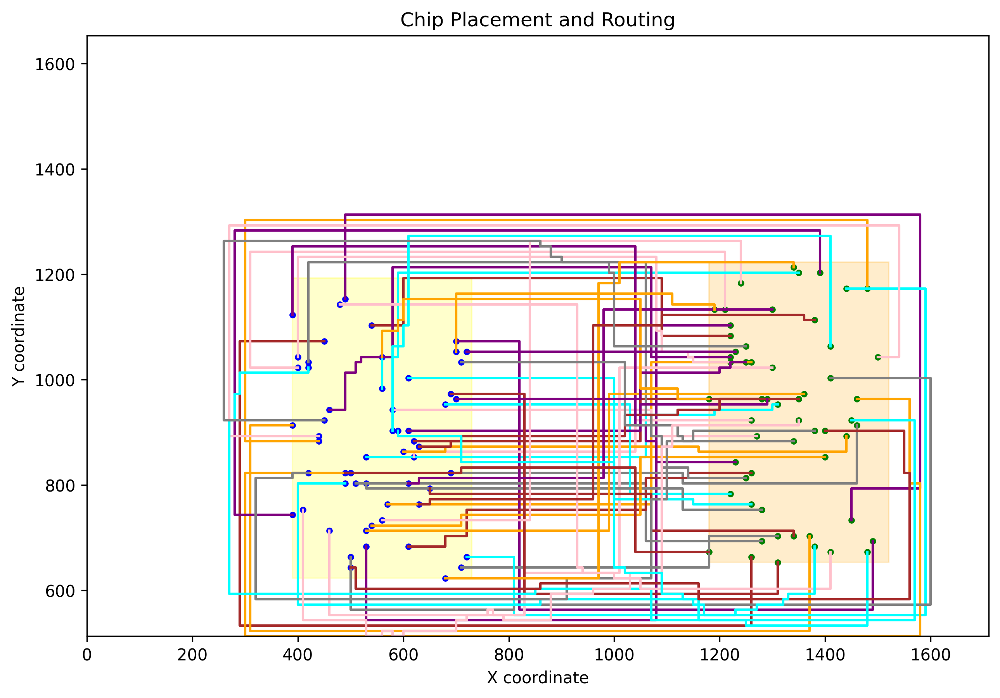
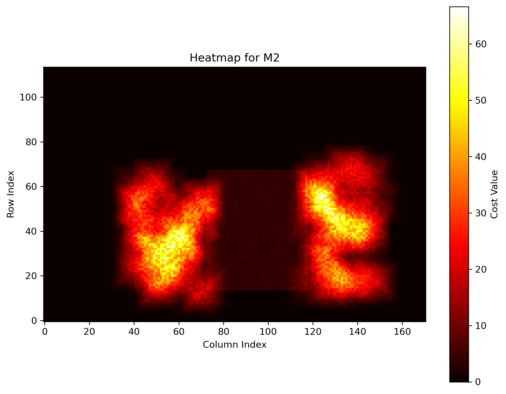
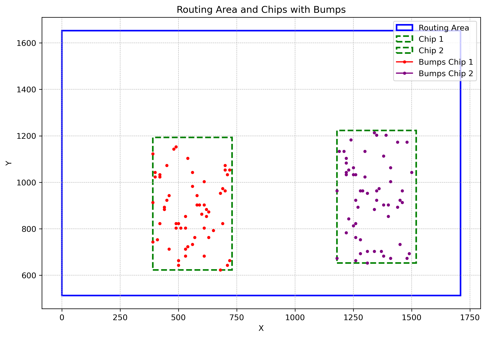

# NYCU PDA Lab 4



## Table of Contents
- [Overview](#overview)
- [Repository Structure](#repository-structure)
- [Images](#images)
- [How to Build](#how-to-build)
- [How to Run](#how-to-run)
- [Visualizer](#visualizer)
- [License](#license)

## Overview
This repository contains the implementation for Lab 4 of the Physical Design Automation (PDA) course at NYCU. The project involves routing and placement algorithms for chip design, with test cases and visualizations.

## Repository Structure
- **main.cpp**: Entry point of the program.
- **Makefile**: Build instructions for the project.
- **inc/**: Header files for the project.
- **src/**: Source files for the project.
- **testcase/**: Contains test cases and related files.
- **images/**: Contains placement images for test cases.
- **visualizer/**: Python script for visualizing the results.

## Images
### Testcase 2
- **M2 Layer**:
  
- **Placement**:
  

## How to Build
1. Ensure you have `make` installed on your system.
2. Run the following command in the terminal:
   ```
   make
   ```

## How to Run
1. After building the project, execute the binary:
   ```
   ./main
   ```
2. Provide the required input files as specified in the lab instructions.

## Visualizer
The `visualizer.py` script in the `visualizer/` directory can be used to visualize the placement and routing results. Ensure you have Python installed to run the script.

## License
This project is for educational purposes and is part of the NYCU PDA course curriculum.

